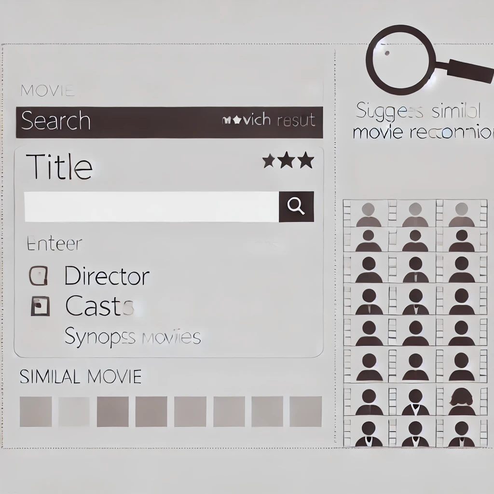

# LangChain Movie Recommender

## 概要

映画作品の詳細情報を検索し、類似作品を提案するWebアプリケーションです。
映画データベースから情報を取得し、LangChainとReasoning Engineを利用して類似作品の推薦を行います。
ユーザーインターフェースはStreamlitを使用して構築されています。

## デモ

[作成中](dummy)

## 機能

- 映画検索
  - 映画タイトルやキーワードで映画情報を検索します。
- 詳細表示
  - 検索結果から選択した映画の詳細情報を表示します。
- 類似作品提案
  - 高精度な類似作品を提案します。

## 使用技術

### LLM

- LangChain
  - LangChainは、言語モデルを活用したアプリケーションを開発するためのオープンソースPythonライブラリです。
- Reasoning Engine
  - Reasoning Engineは、Vertex AIでオーケストレーションフレームワークをカスタマイズしてデプロイできるマネージドサービスで、柔軟な推論処理を実現します。

### データ取得

- The Movie Database (TMDb) API エージェント
  - TMDbは、映画やテレビ番組のデータベースであり、APIを通じて映画の情報を取得できます。
  - 上記APIをLangChainエージェントとして利用します。

### 類似度計算

- FAISS
  - FAISSは、Facebook AI Researchが開発したベクトル検索ライブラリであり、高速な類似度計算を実現します。

### UI

- Streamlit
  - Streamlitは、データサイエンスアプリケーションのためのオープンソースフレームワークです。
